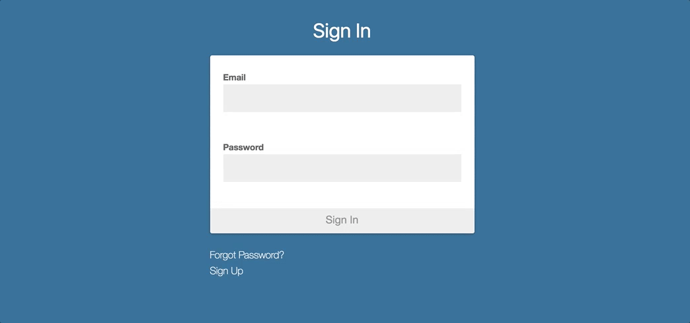

# Angular2-Token

[](https://greenkeeper.io/)
[](https://gitter.im/angular2-token/Lobby)
[](https://badge.fury.io/js/angular2-token)
[](https://npmjs.org/angular2-token)
[](https://travis-ci.org/neroniaky/angular2-token)
[](https://angular.io/styleguide)

Token based authentication service for Angular2 with multiple user support. Angular2-Token works best with the [devise token auth](https://github.com/lynndylanhurley/devise_token_auth) gem for Rails.
Angular2-Token is currently in Alpha. Any contribution is much appreciated.

You can try out Angular2-Token [here](https://angular2-token.herokuapp.com/).

The repository can be found [here](https://github.com/neroniaky/angular2-token-example).

## Installation

### Requirements
- Webpack (SystemJS not tested)

1. Install Angular2-Token via NPM with
    ```bash
    npm install angular2-token
    ```

2. Import and add `Angular2TokenService` to your main module. `Angular2TokenService` depends on `HttpModule` and `RouterModule`, so make sure you import them too.
    ```javascript
    import { Angular2TokenService } from 'angular2-token';

    @NgModule({
        imports: [
            BrowserModule,
            HttpModule,
            RouterModule
        ],
        declarations: [ AppComponent ],
        providers:    [ Angular2TokenService ],
        bootstrap:    [ AppComponent ]
    })
    ```

3. Inject `Angular2TokenService` into your main component and call `.init()`.
    ```javascript
    constructor(private _tokenService: Angular2TokenService) {
        this._tokenService.init();
    }
    ```

## Quickstart (αlpha)
Quickstart includes the necessary forms and routing to quickly use Angular2-Token with your Project. A live demo can be found [here](https://angular2-token.herokuapp.com/#/session/sign-in).

Quickstart is currently in αlpha, please use with caution.



1. Add `A2tUiModule` to your main module.
    ```javascript
    import { Angular2TokenService, A2tUiModule } from 'angular2-token';

    @NgModule({
        imports: [
            BrowserModule,
            HttpModule,
            RouterModule,
            A2tUiModule
        ],
        declarations: [ AppComponent ],
        providers:    [ Angular2TokenService ],
        bootstrap:    [ AppComponent ]
    })
    ```

The `A2tUiModule` adds the following routes to your project:

| Route                      | Description                              |
| -------------------------- | ---------------------------------------- |
| `session/sign-in`          | Sign in form                             |
| `session/sign-up`          | Sign out form                            |
| `session/reset-password`   | Reset password form                      |
| `session/update-password`  | Update password for email redirect       |

On successful sign in the user will be redirect to `restricted`.

## Content
- [Configuration](#configuration)
- [Service Methods](#methods)
    - [`.signIn()`](#signin)
    - [`.signOut()`](#signout)
    - [`.registerAccount()`](#registeraccount)
    - [`.deleteAccount()`](#deleteaccount)
    - [`.validateToken()`](#validatetoken)
    - [`.updatePassword()`](#updatepassword)
    - [`.resetPassword()`](#resetpassword)
    - [`.signInOAuth()`](#signinoauth)
    - [`.processOAuthCallback()`](#processoauthcallback)
- [HTTP Service Wrapper](#http-service-wrapper)
- [Multiple User Types](#multiple-user-types)
- [Route Guards](#route-guards)
- [Advanced Usage](#advanced-usage)
    - [`.sendHttpRequest()`](#sendhttprequest)
    - [`.userSignedIn()`](#usersignedin)
    - [`.currentUserType`](#currentusertype)
    - [`.currentUserData`](#currentuserdata)
    - [`.currentAuthData`](#currentauthdata)
- [Common Problems](#commonproblems)
- [Development](#development)
    - [Testing](#testing)
    - [Credits](#credits)
    - [License](#license)

## Configuration
Configuration options can be passed as `Angular2TokenOptions` via `.init()`.

### Default Configuration
```javascript
constructor(private _tokenService: Angular2TokenService) {
    this._tokenService.init({
        apiBase:                    null,
        apiPath:                    null,

        signInPath:                 'auth/sign_in',
        signInRedirect:             null,
        signInStoredUrlStorageKey:  null,

        signOutPath:                'auth/sign_out',
        validateTokenPath:          'auth/validate_token',
        signOutFailedValidate:      false,

        registerAccountPath:        'auth',
        deleteAccountPath:          'auth',
        registerAccountCallback:    window.location.href,

        updatePasswordPath:         'auth',
        resetPasswordPath:          'auth/password',
        resetPasswordCallback:      window.location.href,

        oAuthBase:                  window.location.origin,
        oAuthPaths: {
            github:                 'auth/github'
        },
        oAuthCallbackPath:          'oauth_callback',
        oAuthWindowType:            'newWindow',
        oAuthWindowOptions:         null,

        userTypes:                  null,

        globalOptions: {
            headers: {
                'Content-Type':     'application/json',
                'Accept':           'application/json'
            }
        }
    });
}
```

| Options                                 | Description                              |
| --------------------------------------- | ---------------------------------------- |
| `apiBase?: string`                      | Sets the server for all API calls.       |
| `apiPath?: string`                      | Sets base path all operations are based on |
| `signInPath?: string`                   | Sets path for sign in                    |
| `signInRedirect?: string`               | Sets redirect path for failed CanActivate |
| `signInStoredUrlStorageKey?: string`    | Sets locale storage key to store URL before displaying signIn page |
| `signOutPath?: string`                  | Sets path for sign out                   |
| `validateTokenPath?: string`            | Sets path for token validation           |
| `signOutFailedValidate?: boolean`       | Signs user out when validation returns a 401 status |
| `registerAccountPath?: string`          | Sets path for account registration       |
| `deleteAccountPath?: string`            | Sets path for account deletion           |
| `registerAccountCallback?: string`      | Sets the path user are redirected to after email confirmation for registration |
| `updatePasswordPath?: string`           | Sets path for password update            |
| `resetPasswordPath?: string`            | Sets path for password reset             |
| `resetPasswordCallback?: string`        | Sets the path user are redirected to after email confirmation for password reset |
| `userTypes?: UserTypes[]`               | Allows the configuration of multiple user types (see [Multiple User Types](#multiple-user-types)) |
| `globalOptions?: GlobalOptions`         | Allows the configuration of global options (see below) |
| `oAuthBase?: string`                    | Configure the OAuth server (used for backends on a different url) |
| `oAuthPaths?: { [key:string]: string }` | Sets paths for sign in with OAuth        |
| `oAuthCallbackPath?:  string`           | Sets path for OAuth sameWindow callback  |
| `oAuthWindowType?:`string`              | Window type for Oauth authentication     |
| `oAuthWindowOptions?: { [key:string]: string }` | Set additional options to pass into `window.open()` |
### Global Options
| Options                               | Description                                     |
| ------------------------------------- | ----------------------------------------------- |
| `headers?: { [key:string]: string; }` | Define custom global headers as hashmap. Be careful when overwriting the default options, `devise token auth` will refuse requests without the `Content-Type`-Header set |

Further information on paths/routes can be found at
[devise token auth](https://github.com/lynndylanhurley/devise_token_auth#usage-tldr)

## Service Methods
Once initialized `Angular2TokenService` offers methods for session management.

### .signIn()
The signIn method is used to sign in the user with email address and password.
The optional parameter `type` specifies the name of UserType used for this session.

`signIn({email: string, password: string, userType?: string}): Observable<Response>`

#### Example:
```javascript
this._tokenService.signIn({
    email:    'example@example.org',
    password: 'secretPassword'
}).subscribe(
    res =>      console.log(res),
    error =>    console.log(error)
);
```

### .signOut()
The signOut method destroys session and session storage.

`signOut(): Observable<Response>`

#### Example:
```javascript
this._tokenService.signOut().subscribe(
    res =>      console.log(res),
    error =>    console.log(error)
);
```

### .registerAccount()
Sends a new user registration request to the Server.

`registerAccount({email: string, password: string, passwordConfirmation: string, userType?: string}): Observable<Response>`

#### Example:
```javascript
this._tokenService.registerAccount({
    email:                'example@example.org',
    password:             'secretPassword',
    passwordConfirmation: 'secretPassword'
}).subscribe(
    res =>      console.log(res),
    error =>    console.log(error)
);
```

### .deleteAccount()
Deletes the account for the signed in user.

`deleteAccount(): Observable<Response>`

#### Example:
```javascript
this._tokenService.deleteAccount().subscribe(
    res =>      console.log(res),
    error =>    console.log(error)
);
```

### .validateToken()
Validates the current token with the server.

`validateToken(): Observable<Response>`

#### Example:
```javascript
this._tokenService.validateToken().subscribe(
    res =>      console.log(res),
    error =>    console.log(error)
);
```

### .updatePassword()
Updates the password for the logged in user.
`updatePassword({password: string, passwordConfirmation: string, passwordCurrent: string, userType?: string, resetPasswordToken?: string}): Observable<Response>`

#### Example:
```javascript
this._tokenService.updatePassword({
    password:             'newPassword',
    passwordConfirmation: 'newPassword',
    passwordCurrent:      'oldPassword',
    resetPasswordToken:   'resetPasswordToken',
}).subscribe(
    res =>      console.log(res),
    error =>    console.log(error)
);
```

### .resetPassword()
Request a password reset from the server.

`resetPassword({email: string, userType?: string}): Observable<Response>`

#### Example:
```javascript
this._tokenService.resetPassword({
    email: 'example@example.org',
}).subscribe(
    res =>      console.log(res),
    error =>    console.log(error)
);
```

### .signInOAuth()
Initiates OAuth authentication flow. Currently, it supports two window modes:
`newWindow` (default) and `sameWindow` (settable in config as `oAuthWindowType`).
- When `oAuthWindowType` is set to `newWindow`, `.signInOAuth()` opens a new window and returns an observable.

- When `oAuthWindowType` is set to `sameWindow`, `.signInOAuth()` returns nothing and redirects user to auth provider.
After successful authentication, it redirects back to `oAuthCallbackPath`. Application router needs to intercept
this route and call `processOAuthCallback()` to fetch `AuthData` from params.

`signInOAuth(oAuthType: string)`

#### Example:

```javascript
this._tokenService.signInOAuth(
'github'
).subscribe(
    res =>      console.log(res),
    error =>    console.log(error)
);
```

### .processOAuthCallback()
Fetches AuthData from params sent via OAuth redirection in `sameWindow` flow.

`processOAuthCallback()`

#### Example

Callback route:
```javascript
RouterModule.forRoot([
  { path: 'oauth_callback', component: OauthCallbackComponent }
])
```

Callback component:
```javascript
@Component({
  template: ''
})
export class OauthCallbackComponent implements OnInit {
  constructor(private _tokenService: Angular2TokenService) {}

  ngOnInit() {
    this._tokenService.processOAuthCallback();
  }
}
```

## HTTP Service Wrapper
`Angular2TokenService` wraps all standard Angular2 Http Service calls for authentication and token processing.
If `apiPath` is configured it gets added in front of path.
- `get(url: string, options?: RequestOptionsArgs): Observable<Response>`
- `post(url: string, body: any, options?: RequestOptionsArgs): Observable<Response>`
- `put(url: string, body: any, options?: RequestOptionsArgs): Observable<Response>`
- `delete(url: string, options?: RequestOptionsArgs): Observable<Response>`
- `patch(url: string, body: any, options?: RequestOptionsArgs): Observable<Response>`
- `head(url: string, options?: RequestOptionsArgs): Observable<Response>`
- `options(url: string, options?: RequestOptionsArgs): Observable<Response>`

#### Example:
```javascript
this._tokenService.get('my-resource/1').map(res => res.json()).subscribe(
    res =>      console.log(res),
    error =>    console.log(error)
);
```

## Multiple User Types
An array of `UserType` can be passed in `Angular2TokenOptions` during `init()`.
The user type is selected during sign in and persists until sign out.
`.currentUserType` returns the currently logged in user.

#### Example:
```javascript
this._tokenService.init({
    userTypes: [
        { name: 'ADMIN', path: 'admin' },
        { name: 'USER', path: 'user' }
    ]
});

this._tokenService.signIn({
    email:    'example@example.com',
    password: 'secretPassword',
    userType: 'ADMIN'
})

this._tokenService.currentUserType; // ADMIN
```

## Route Guards
Angular2-Token implements the `CanActivate` interface, so it can directly be used as a route guard.
If the `signInRedirect` option is set the user will be redirected on a failed (=false) CanActivate using `Router.navigate()`.
It currently does not distinguish between user types.

#### Example:
```javascript
const routerConfig: Routes = [
    {
        path: '',
        component: PublicComponent
    }, {
        path: 'restricted',
        component: RestrictedComponent,
        canActivate: [Angular2TokenService]
    }
];
```

## Advanced Usage
More advanced methods can be used if a higher degree of customization is required.

### .request()
More customized requests can be send with the `.request()`-function. It accepts the RequestOptionsArgs-Interface.
More information can be found in the Angular2 API Reference [here](https://angular.io/docs/ts/latest/api/http/index/RequestOptionsArgs-interface.html).

`request(options: RequestOptionsArgs): Observable<Response>`

#### Example:
```javascript
this._tokenService.request({
    method: RequestMethod.Post,
    url:    'my-resource/1',
    data:   mydata
});
```

### .userSignedIn()
Returns `true` if a user is signed in. It does not distinguish between user types.

`userSignedIn(): boolean`

### .currentUserType
Returns current user type as string like specified in the options.

`get currentUserType(): string`

### .currentUserData
Returns current user data as returned by devise token auth.
This variable is `null` after page reload until the `.validateToken()` call is answerd by the backend.

`get currentUserData(): UserData`

### .currentAuthData
Returns current authentication data which are used to set auth headers.

`get currentAuthData(): AuthData`

### .currentAuthHeaders
Returns current authentication data as an HTTP ready Header object.

`get currentAuthHeaders(): Header`

### Redirect original requested URL
If you want to redirect to the protected URL after signing in, you need to set `signInStoredUrlStorageKey` and in your code you can do something like this

```js
this._tokenService.signIn({
    email:    'example@example.org',
    password: 'secretPassword'
}).subscribe(
    res => {
        // You have to add Router DI in your component
        this.router.navigateByUrl(localStorage.getItem('redirectTo'));
    },
    error =>    console.log(error)
);
```
## Common Problems

### CORS Configuration
If you are using CORS in your Rails API make sure that `Access-Control-Expose-Headers` includes `access-token`, `expiry`, `token-type`, `uid`, and `client`.
For the rack-cors gem this can be done by adding the following to its config.
More information can be found [here](https://github.com/lynndylanhurley/devise_token_auth#cors).
    ```ruby
    :expose  => ['access-token', 'expiry', 'token-type', 'uid', 'client']
    ```

### Missing Routes
Make sure that your projects includes some kind of routing.

## Development
If the package is installed from Github specified in the package.json, you need to build the package locally.

```bash
cd ./node_modules/angular2-token
npm install
npm run build
```

### Testing
```bash
npm test
```

### Credits
Test config files based on [Angular2 Webpack Starter](https://github.com/AngularClass/angular2-webpack-starter) by AngularClass

### License
The MIT License (see the [LICENSE](https://github.com/neroniaky/angular2-token/blob/master/LICENSE) file for the full text)
